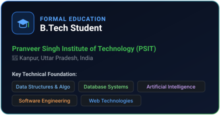
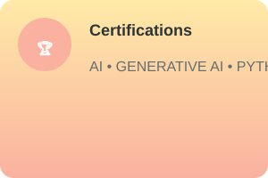
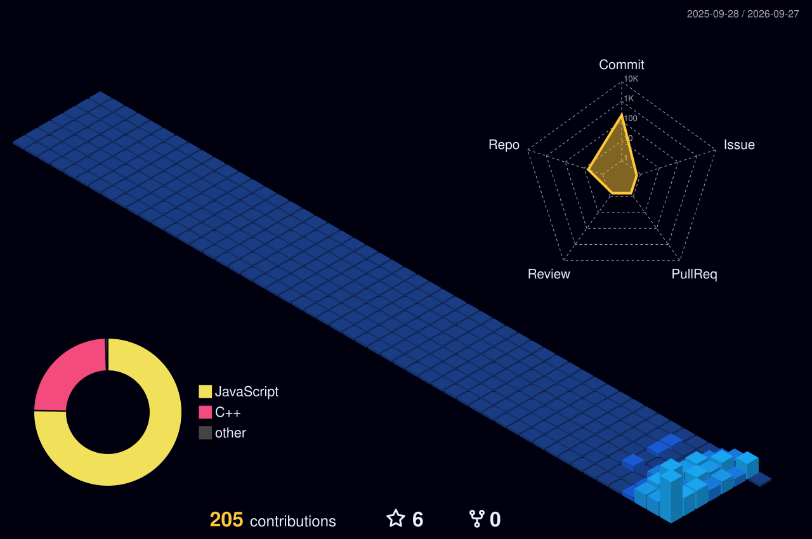
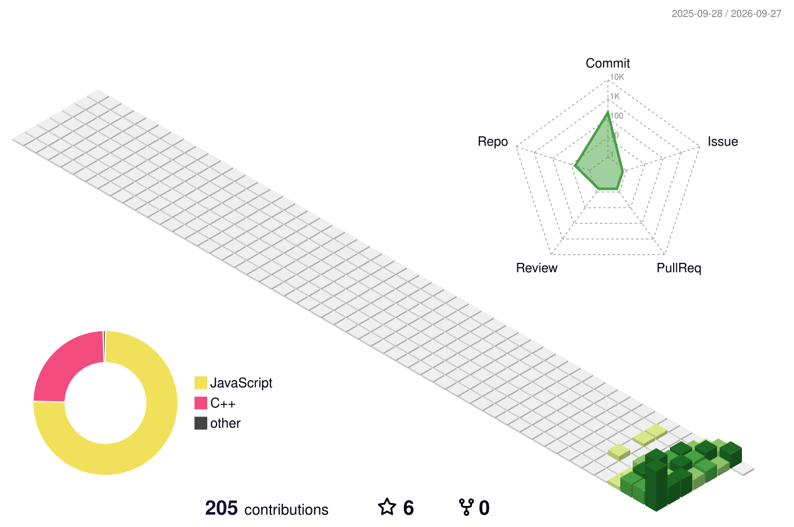
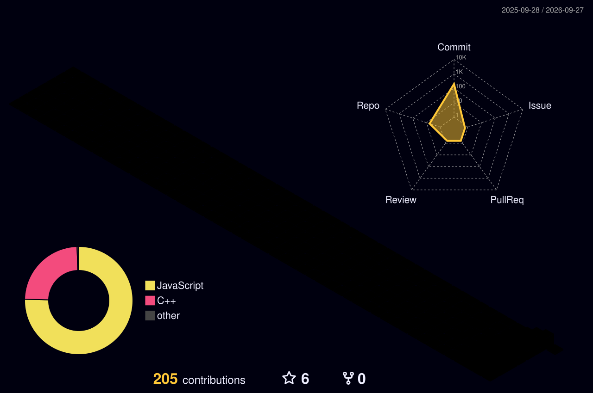
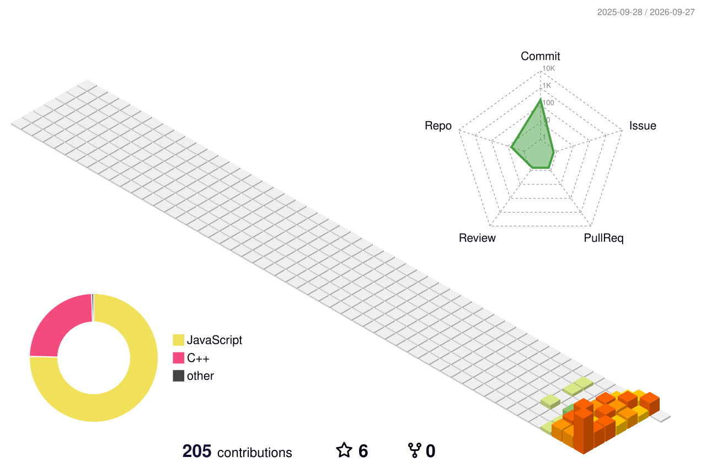

  

<!-- Animated Typing Banner -->

  

<!-- Header Badges Row -->

  
  
  

 

<!-- Small Animated Coders Greeting -->

  
  

 

## 👨‍💻 Hello there, fellow engineer! 

> [!NOTE]
> - 🚀 **Current Focus**: Architecting AI-assisted products, modern web platforms, and deep-diving into **Python**, **React / Next.js**, and backend micro-systems.

> [!IMPORTANT]
> - 🛠️ **Active Builds**: Developing **PrepWise AI Interviewer** (voice-driven AI interview simulation) and **JaanchKaro** (fraud signal & risk detection system).

> [!TIP]
> - 🧠 **Core Foundation**: Strengthening Data Structures & Algorithms, system scalability patterns, and prompt engineering pipelines.

> [!WARNING]
> - 🤝 **Open for Opportunities**: Actively seeking software engineering internships, technical collaborations, and impactful open-source contributions.

  
  
  
  

<!-- Animated Section Divider -->

  

---

## 🛠️ Technical Architecture & Skills

| **Programming Languages** | **Frontend Technologies** | **Backend & APIs** | **Databases & Cloud** | **AI & Generative AI** | **DevOps & Tools** |
| :---: | :---: | :---: | :---: | :---: | :---: |
|  |  |  |  |  |  |
|  |  |  |  |  |  |
|  |  |  |  |  |  |
|  |  |  |  |  |  |
|  |  /  |  |  |  |  |

 

<!-- Visual Cards: Education & Certificates -->

  
  &nbsp;&nbsp;
  

<!-- Animated Section Divider -->

  

---

## 📊 Engineering Analytics & Activity Metrics

  <!-- Streak Stats Card -->
  

    

  <!-- GitHub Core Metrics (Generated via lowlighter/metrics) -->
  

    

  <!-- Top Languages & Activity Distribution (Side-by-Side) -->
  <table width="100%" border="0">
    <tr>
      <td width="50%" align="center" valign="top">
        
      </td>
      <td width="50%" align="center" valign="top">
        
      </td>
    </tr>
  </table>

<!-- Animated Section Divider -->

  

---

## 🌐 3D Contribution Landscape

  
<strong>Actual 3D GitHub Contribution Matrix — Night View</strong>

  

  
<strong>🎨 Expand Alternative 3D Themes (Animated Emerald Green, Seasonal, Rainbow)</strong>

   

  

    <h4>🟢 Emerald Green Animated 3D</h4>
    
      

    <h4>🌈 Night Rainbow 3D</h4>
    
      

    <h4>🍂 Seasonal Animated 3D</h4>
    
  

<!-- Animated Section Divider -->

  

---

## 🐍 Dynamic Contribution Games & Visualizations

### 🎮 Contribution Snake Animation

  

 

### 👾 Pac-Man Contribution Arcade

  <a href="https://github.com/Pulkit0719">
    <picture>
      <source media="(prefers-color-scheme: dark)" srcset="./dist/pacman-contribution-graph-dark.svg">
      <source media="(prefers-color-scheme: light)" srcset="./dist/pacman-contribution-graph.svg">
      
    </picture>
  </a>

 

### 🎨 GitArtwork Contribution Matrix

  

<!-- Animated Section Divider -->

  

---

## 🚀 Featured Engineering Projects

### 1. **PrepWise AI Interviewer**
**Autonomous Voice-Driven Mock Interview & Career Preparation Platform**

- **Dynamic Voice AI Interviews**: Real-time conversational interview sessions with low-latency speech synthesis and adaptive questioning.
- **Resume Parsing & Intelligence**: Validates and extracts candidate experience from uploaded resume PDFs using `pdf-parse` and LLM reasoning.
- **Contextual Questioning**: Synthesizes resume-specific technical questions tailored to declared projects and experience level.
- **Actionable Scoring & Analytics**: Generates granular metric scorecards, personalized remediation study roadmaps, and reviewable transcripts.
- **Robust Cloud Infrastructure**: Firebase Authentication, Firestore private document persistence, and secure Storage integration.

---

### 2. **JaanchKaro**
**Fake & Suspicious Internship Risk Detection System**

[-2ea043?style=flat-square)](https://github.com/Pulkit0719)

- **Fraud Signal Detection**: Automated heuristic engine evaluating offer letters, job posts, and suspicious hiring workflows.
- **Explainable Evidence**: Pinpoints exact indicators (unverified domains, anomalous stipend claims, advance-fee red flags).
- **Risk Scoring**: Delivers transparent forensic signals and quantified risk indicators.
- **Actionable Guidance**: Direct recommendation matrices for candidate protection.

---

### 3. **Evara**
**Women-Centric Menstrual Health & Holistic Wellness Platform**

- **Cycle Prediction Engine**: Calculates cycle variability, flow intensity, and forecast windows with statistical tracking.
- **Holistic Metric Logging**: Comprehensive data logging for symptoms, energy, sleep, hydration, and stress levels.
- **Visual Analytics**: Interactive Recharts data visualizations and calendar-based pattern mapping.
- **Privacy & Portability**: User-scoped data privacy, tamper-safe architecture, JSON export, and complete data erasure controls.

---

  
<strong>📁 Additional Public Repositories & Engineering Work</strong>

   

  

| Repository | Focus & Stack | Status | Link |
| :--- | :--- | :---: | :---: |
| **AirAware** | Environmental Monitoring & Air Quality Insights | Active | [View Repository](https://github.com/Pulkit0719/AirAware) |
| **uptrail-v2** | Career Progression Tracking Engine (TypeScript) | Active | [View Repository](https://github.com/Pulkit0719/uptrail-v2) |
| **LeetCode** | Algorithmic Problem Solving & Data Structures (C++, Python) | Continuous | [View Repository](https://github.com/Pulkit0719/LeetCode) |
| **developer-portfolios** | Portfolio Showcase & Modular Profile Architectures | Maintained | [View Repository](https://github.com/Pulkit0719/developer-portfolios) |

  

<!-- Animated Section Divider -->

  

---

## 🎓 Academic Background & Verified Certifications

### 🏛️ Higher Education
- **Degree**: Bachelor of Technology (B.Tech)
- **Institution**: Pranveer Singh Institute of Technology (PSIT), Kanpur, Uttar Pradesh, India
- **Core Coursework**: Data Structures, Design & Analysis of Algorithms, Database Management Systems, Software Engineering Principles, Artificial Intelligence, Web Technologies

---

### 🏆 Selected Specializations & Certifications

| Specialization / Certificate | Issuing Organization | Verification Link |
| :--- | :---: | :---: |
| **Google AI Essentials** | Google | [Verify Credential](https://coursera.org/verify/specialization/FHC596DEJ5P1) |
| **Generative AI Leader** | Google Cloud | [Verify Credential](https://coursera.org/verify/professional-cert/JTDCMTDATCAN) |
| **Introduction to Generative AI Learning Path** | Google Cloud | [Verify Credential](https://coursera.org/verify/specialization/U1K9SJWN0I9Y) |
| **Generative AI Strategic Leader** | Vanderbilt University | [Verify Credential](https://coursera.org/verify/specialization/W3ODB5459A93) |
| **Introduction to Artificial Intelligence (AI)** | IBM | [Verify Credential](https://coursera.org/verify/EDCTSASDNY9Q) |
| **Data Analysis with Python** | IBM | [Verify Credential](https://coursera.org/verify/XAIWT9E9AZFU) |
| **Python Project for Data Science** | IBM | [Verify Credential](https://coursera.org/verify/YQ6UZKSU7VXN) |

  
<strong>📜 View All 14 Verified Professional Certificates</strong>

   

  

1. **Google AI Essentials** (5-course specialization)  
   Provider: Google • [Verify on Coursera](https://coursera.org/verify/specialization/FHC596DEJ5P1)

2. **Generative AI Leader** (Professional Certificate)  
   Provider: Google Cloud • [Verify on Coursera](https://coursera.org/verify/professional-cert/JTDCMTDATCAN)

3. **Introduction to Generative AI Learning Path** (4-course specialization)  
   Provider: Google Cloud • [Verify on Coursera](https://coursera.org/verify/specialization/U1K9SJWN0I9Y)

4. **Generative AI Strategic Leader** (4-course specialization)  
   Provider: Vanderbilt University • [Verify on Coursera](https://coursera.org/verify/specialization/W3ODB5459A93)

5. **Introduction to Artificial Intelligence (AI)**  
   Provider: IBM • [Verify on Coursera](https://coursera.org/verify/EDCTSASDNY9Q)

6. **Data Analysis with Python**  
   Provider: IBM • [Verify on Coursera](https://coursera.org/verify/XAIWT9E9AZFU)

7. **Python Project for Data Science**  
   Provider: IBM • [Verify on Coursera](https://coursera.org/verify/YQ6UZKSU7VXN)

8. **Prompt Engineering for ChatGPT**  
   Provider: Vanderbilt University • [Verify on Coursera](https://coursera.org/verify/DBCALISN0MZV)

9. **Generative AI Primer**  
   Provider: Vanderbilt University • [Verify on Coursera](https://coursera.org/verify/AVT0RJJY5MJQ)

10. **Gen AI: Navigate the Landscape**  
    Provider: Google Cloud • [Verify on Coursera](https://coursera.org/verify/ANTX5ZETVZ65)

11. **Introduction to AI**  
    Provider: Google • [Verify on Coursera](https://coursera.org/verify/SHCFX6I8G0CV)

12. **Discover the Art of Prompting**  
    Provider: Google • [Verify on Coursera](https://coursera.org/verify/NLPL2N9QXGEF)

13. **Use AI Responsibly**  
    Provider: Google • [Verify on Coursera](https://coursera.org/verify/0VDHLUCNOE1E)

14. **Stay Ahead of the AI Curve**  
    Provider: Google • [Verify on Coursera](https://coursera.org/verify/L9UIJ7B81GOB)

  

<!-- Animated Section Divider -->

  

---

## ⏱️ Real-Time Analog System Clock

  <em>Live CSS-animated analog clock dial themed to GitHub Dark Navy &amp; Electric Blue</em>
    
  

  

<!-- Animated Wave Bottom Transition -->

  

<!-- Back to Top Navigation -->

  

  Engineered with precision &amp; passion by <strong>Pulkit Porwal</strong> • © 2026 Pulkit0719

